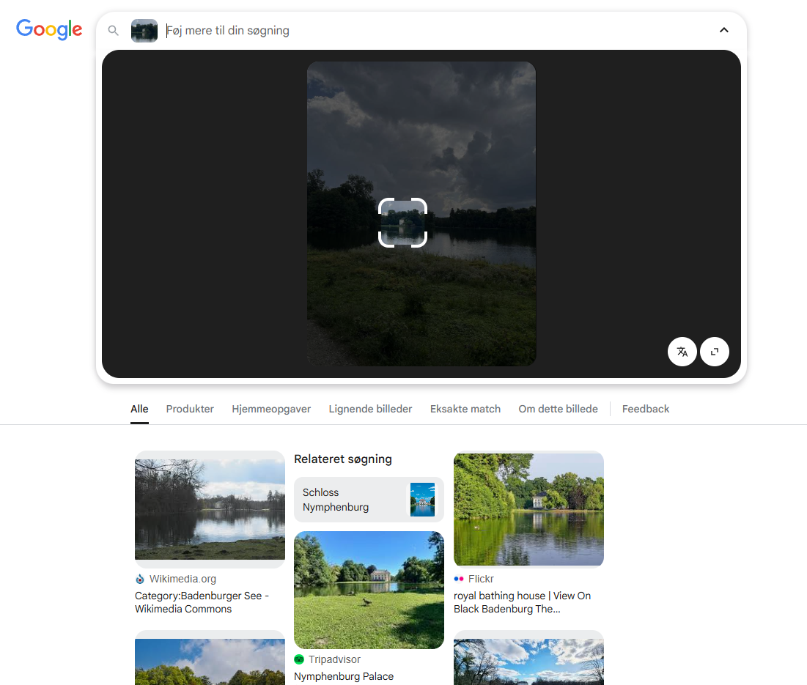
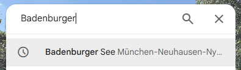
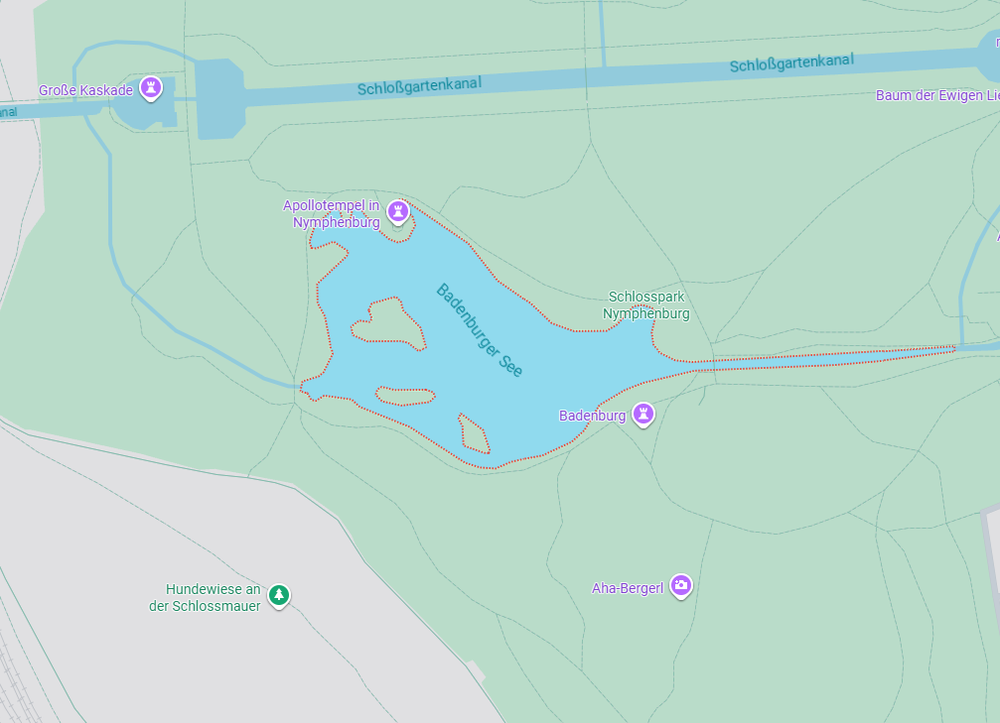
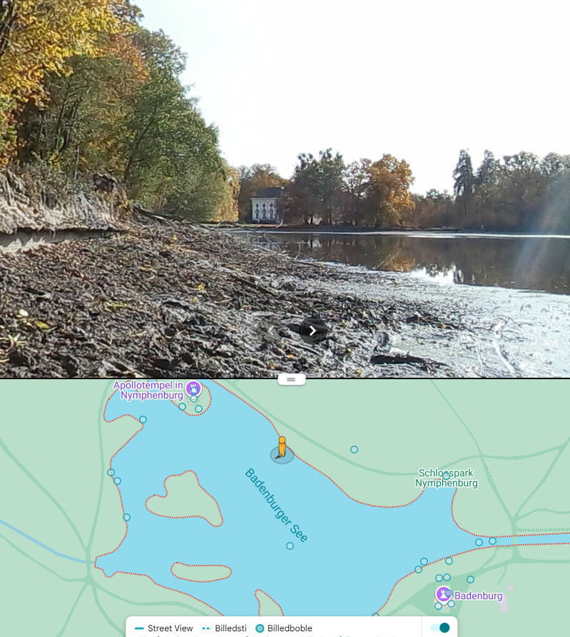
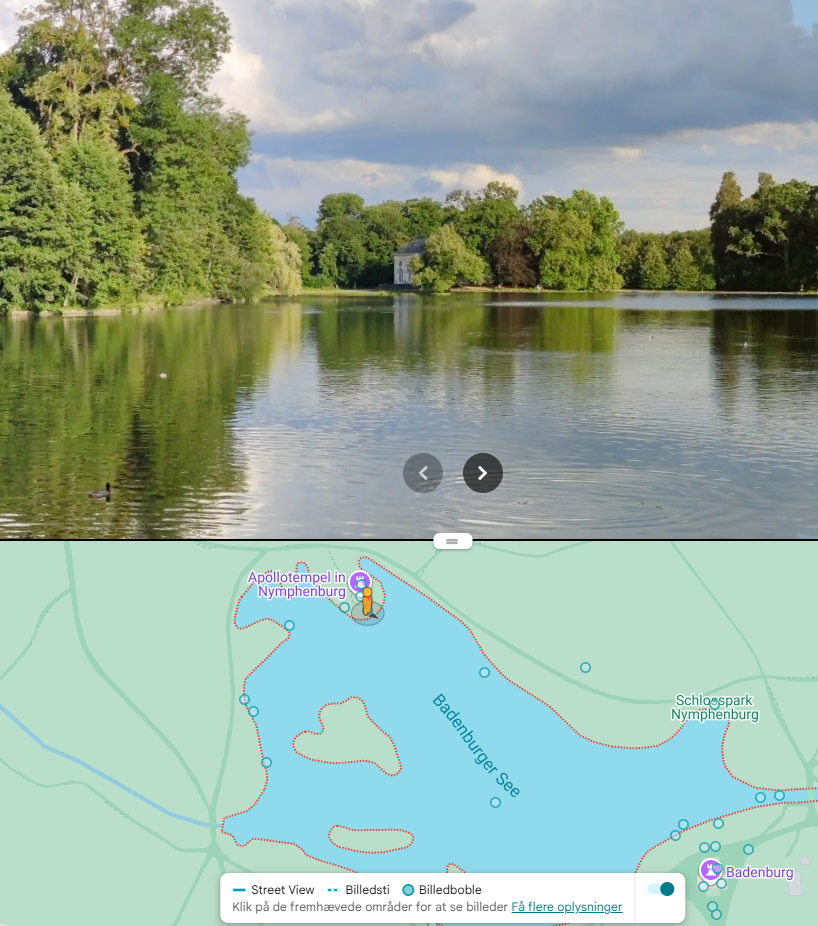
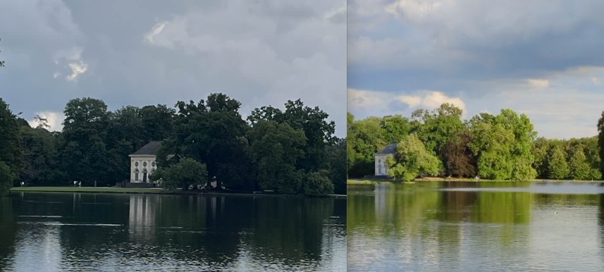
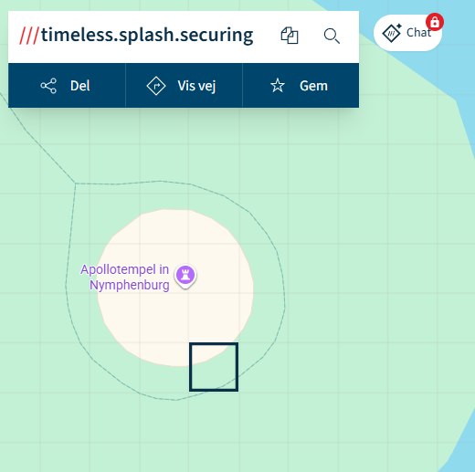
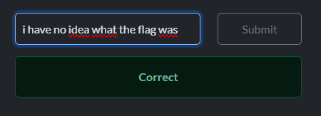

# Traditional Cake

### Challenge information
Category: OSINT
Difficulty: Medium
Author: OddNorseman

I tried this amazing traditional cake at this amazing place I visited... but now I don't remember what it was called and where I was. All I have is this picture I took some time before.

Can you help me find the exact spot I took the image from, so I can try to retrace my steps?

Flag format: Use what3words (https://what3words.com/pages.explores.reaction) to find the 3-word code for the location (without leading slashes) and wrap in brunner{}.
So, if the location found has code apricot.surfer.uses, the flag would be brunner{apricot.surfer.uses}.

Note: Make sure "3 word address language" is set to English in your what3words settings to get the right code.

*Has attached file, osint_traditional-cake.zip*  
Content of zip file: 

# Solving the challenge

### Run the image through Google Image search
  
Making sure to having zoomed in on our object of interest, the house, we can see it is a burger, but not just any burger, its Badenburger, a royal bathhouse.

### Find location
If we head to the wikimedia.org link, the first result, https://commons.wikimedia.org/wiki/Category:Badenburger_See we can see it is located in Munich, Germany.  
Head to Google Maps and locate that burger  
  

### Verify location
The dude on the map is pointing the wrong way, but it is definitely the right building  

### Find the correct angle
Teleporting over here fits the angle pretty good  
  
Side by side comparison:  

### Find What3Words coords  
I picked this square, since the original photo included a bit of path  
  
I must have submitted like 10 flags, none of them were correct. I asked my teammate for help and it was solved within an hour.  
