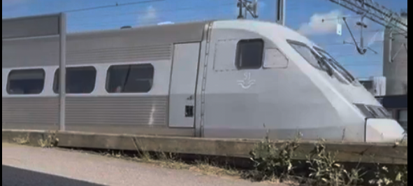
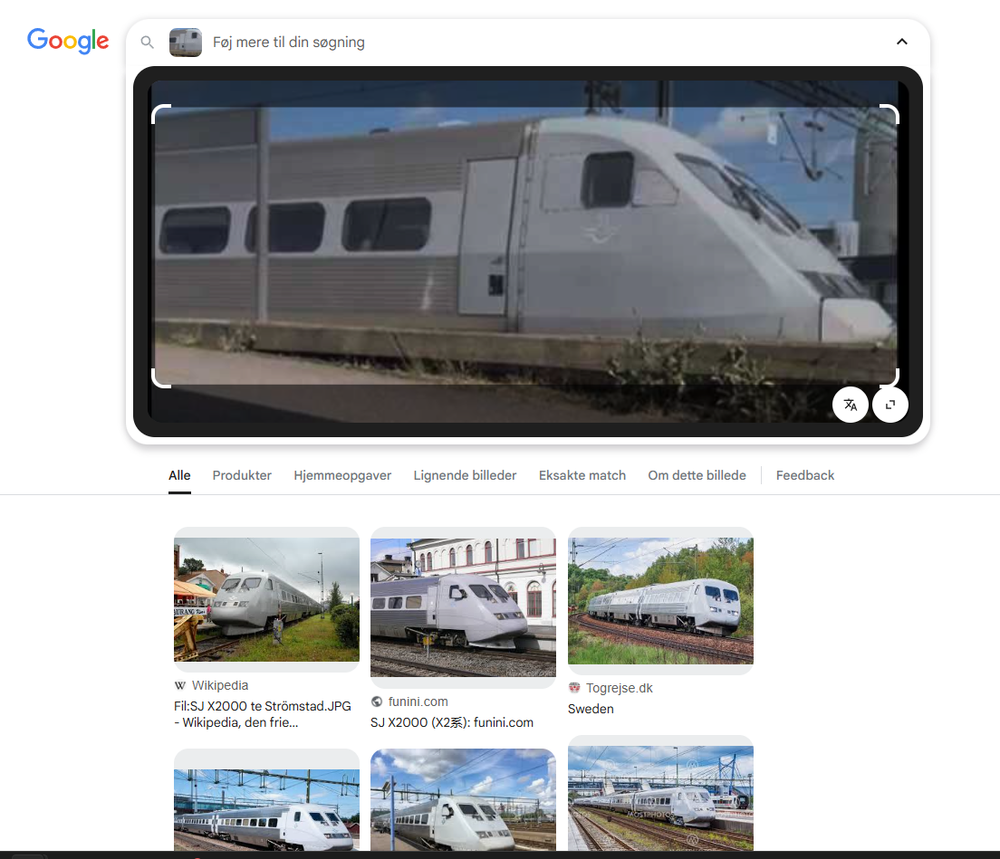

# Train Mania

### Challenge information
Category: OSINT
Difficulty: Easy
Author: Quack

I recently stumpled upon this cool train! But I'd like to know a bit more about it... Can you please tell me the operating company, model number and its maximum service speed (km/h in regular traffic)?

The flag format is brunner{OPERATOR-MODELNUMBER-SERVICESPEED}.
So if the operator you have found is DSB, the model number RB1, and the maximum service speed is 173 km/h, the flag would be brunner{DSB-RB1-173}.

*Has an attached .mp4 file of a moving train, duration is 4 seconds. We grab the last frame, that looks like this:*  

# Solving the challenge

### Run the image through Google Image search
We immediately get some results showing a `SJ X2000` train.  
Comparing the logo on the side of the train to the logo on the SJ X2000 trains, it seems like a perfect match.  

### Wikipedia the train
https://en.wikipedia.org/wiki/X_2000 shows the following information:  
Official name: X2  
Operator: SJ  
Commercial speed: 200km/h  
  
This gives us the flag `SJ-X2-200`